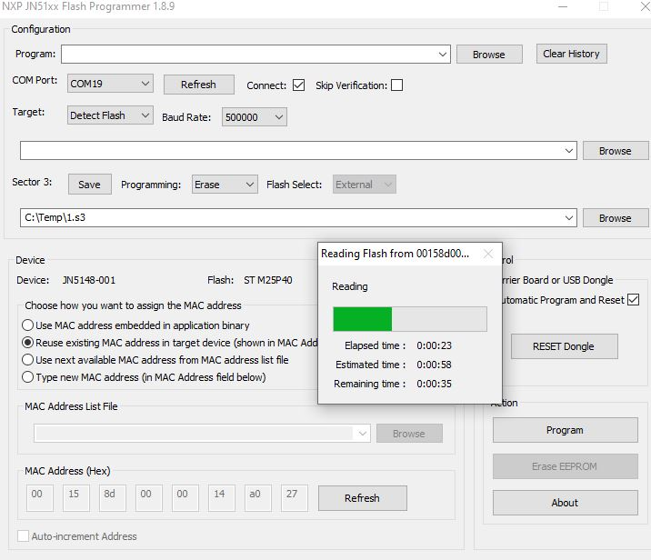

Yes, the JN5148-001-M04 module is old. NXP has professionally erased all documents and software from their website except for the [product brief](https://www.nxp.com/products/no-longer-manufactured/32-bit-mcu-and-ieee802-15-4-transceiver:JN5148).

However, I have some JN5148-001-M04 modules and want to play with them. So I created this crude breakout board.

# Assembly instructions

Solder all components except the module. Clean PCB.

Test if 3V3 regulator works by connecting 5V (with 50mA power limit). The board should not use any significant current. Measure the 3V3 OUT-pin, it should be 3.3V.

Now solder module.

# Test programming mode

Use 'NXP JN51xx Flash Programmer 1.8.9'. Connect a 3.3V serial to USB converter (like a FT232RL) and put Jennic module into program mode by pressing and holding PGM while short pressing RST.\
When selecting a COM Port the programming software should identify the device type, flash chip and MAC Address.

